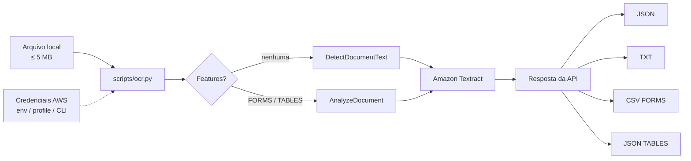

# OCR na AWS com Amazon Textract

CLI em Python que extrai texto de imagens e PDFs locais com **Amazon Textract** e salva os resultados em arquivos — pronto para demonstrar em entrevistas e no GitHub.

**Curso:** Nexa — Análise Avançada de Imagens e Texto com IA na AWS  
**Foco deste repositório:** OCR documental com Amazon Textract (API síncrona, até 5 MB)

| Stack | Destaques |
|-------|-----------|
| Python · boto3 · Amazon Textract | CLI com `argparse`, validação de arquivo, tratamento de erros AWS |
| Credenciais via ambiente / AWS CLI | Sem secrets no código |
| Saídas locais (JSON, TXT, CSV) | Adequado a demo de portfólio |

> Os prints e métricas abaixo são **placeholders**. Só substitua após executar o projeto com documentos sintéticos ou públicos.

---

## Por que este projeto

Mostra, de ponta a ponta, uma integração real com um serviço de IA da AWS:

1. Validar e ler um documento local
2. Chamar `DetectDocumentText` ou `AnalyzeDocument` (FORMS / TABLES)
3. Persistência estruturada das saídas
4. Uso seguro do padrão de credenciais da AWS SDK

---

## Comparativo da trilha

Este desafio faz parte de uma trilha de IA na AWS. A tabela abaixo posiciona os projetos irmãos — **este repo cobre o OCR genérico com Textract**.

| Projeto | Objetivo | Serviço AWS principal | Entrada | Saída | Aprendizado |
|---------|----------|------------------------|---------|-------|-------------|
| **OCR CNH** | Extrair campos de documento de identidade em cenário controlado | Amazon Textract | Imagem sintética de CNH (sem dados reais) | Texto / campos estruturados | OCR orientado a documento + cuidado com PII/LGPD |
| **OCR Lista Escolar** | Ler listas e conteúdo tabular de documentos escolares | Amazon Textract | Imagem/PDF de lista ou tabela | Texto e/ou tabelas estruturadas | Feature `TABLES` e organização de dados extraídos |
| **Reconhecimento de Atacantes** | Detectar/comparar faces em contexto de segurança (estudo) | Amazon Rekognition | Imagens de faces (amostras autorizadas) | Labels / similaridade de faces | Visão computacional além de OCR; ética e privacidade |
| **Reconhecimento de Celebridades** | Identificar celebridades em imagens | Amazon Rekognition | Foto com pessoas públicas | Nome(s) e confiança | API de celebridades e interpretação de score |
| **Este projeto (OCR Textract)** | OCR genérico de imagens/PDFs locais para portfólio | Amazon Textract | PNG, JPG, TIFF ou PDF ≤ 5 MB | JSON completo, TXT, CSV (FORMS), JSON (TABLES) | CLI, APIs síncronas, forms/tables e DX segura |

---

## DetectDocumentText vs AnalyzeDocument

| | DetectDocumentText | AnalyzeDocument |
|--|--------------------|-----------------|
| **Quando** | Só precisa do texto | Precisa de estrutura |
| **Retorno** | Linhas e palavras (`LINE`, `WORD`) | Texto + `FORMS` e/ou `TABLES` |
| **Neste CLI** | Padrão (sem `--features`) | `--features FORMS` e/ou `TABLES` |

---

## Arquitetura



Fluxo: validar arquivo → ler bytes → chamar Textract → gravar em `output/` (ou no caminho de `--out`).

---

## Estrutura

```text
aws-textract-ocr-portfolio/
├── README.md
├── requirements.txt
├── .gitignore
├── scripts/ocr.py          # CLI principal
├── images/sample/          # amostras sintéticas / públicas
├── output/                 # resultados gerados (não versionados)
└── prints/                 # evidências para o portfólio
```

---

## Pré-requisitos

- Python 3.10+
- Conta AWS com IAM mínimo:
  - `textract:DetectDocumentText`
  - `textract:AnalyzeDocument` (se usar `--features`)
- Credenciais **fora do código**: `aws configure`, variáveis `AWS_*` ou `AWS_PROFILE`

Regiões usuais: `us-east-1`, `us-west-2`, `eu-west-1` — [lista oficial](https://docs.aws.amazon.com/general/latest/gr/textract.html).

---

## Como rodar

### Linux / macOS

```bash
cd aws-textract-ocr-portfolio
python3 -m venv .venv
source .venv/bin/activate
pip install -r requirements.txt

export AWS_DEFAULT_REGION=us-east-1
# export AWS_PROFILE=meu-perfil

python scripts/ocr.py images/sample/seu-arquivo.png
```

### Windows (PowerShell)

```powershell
cd aws-textract-ocr-portfolio
python -m venv .venv
.\.venv\Scripts\Activate.ps1
pip install -r requirements.txt

$env:AWS_DEFAULT_REGION = "us-east-1"
# $env:AWS_PROFILE = "meu-perfil"

python scripts/ocr.py images/sample/seu-arquivo.png
```

---

## Exemplos de uso

```bash
# Texto (DetectDocumentText)
python scripts/ocr.py images/sample/documento.png

# Formulários
python scripts/ocr.py images/sample/formulario.jpg --features FORMS

# Tabelas
python scripts/ocr.py images/sample/tabela.png --features TABLES

# FORMS + TABLES, saída e região explícitas
python scripts/ocr.py images/sample/documento.pdf \
  --features FORMS TABLES \
  --out output/demo \
  --region us-east-1
```

| Arquivo gerado | Conteúdo |
|----------------|----------|
| `<base>.json` | Resposta completa da API |
| `<base>.txt` | Linhas de texto |
| `<base>_forms.csv` | Chave/valor (se `FORMS`) |
| `<base>_tables.json` | Matrizes (se `TABLES`) |

**Entrada aceita:** `.png`, `.jpg`, `.jpeg`, `.tif`, `.tiff`, `.pdf` · **limite:** 5 MB (API síncrona).

---

## Resultados

> Ainda sem evidências versionadas. Após rodar o script com amostra sintética, salve as capturas em `prints/` e substitua os placeholders abaixo.

| # | Evidência | Arquivo | Status |
|---|-----------|---------|--------|
| 1 | Terminal com comando e sucesso | `prints/01-execucao-terminal.png` | Placeholder |
| 2 | Texto extraído (`.txt`) | `prints/02-texto-extraido.png` | Placeholder |
| 3 | Trecho da resposta (`.json`) | `prints/03-resposta-json.png` | Placeholder |
| 4 | Campos de formulário (`.csv`) | `prints/04-forms-csv.png` | Placeholder — opcional |
| 5 | Tabelas (`.json`) | `prints/05-tables-json.png` | Placeholder — opcional |
| 6 | Console AWS Textract | `prints/06-console-aws.png` | Placeholder — opcional |

### 1. Execução no terminal


*Aguardando print real: comando executado + mensagem de sucesso e caminhos gerados.*

### 2. Texto extraído


*Aguardando print real: trecho do `.txt` produzido pelo Textract.*

### 3. Resposta JSON


*Aguardando print real: blocos `LINE` / `WORD` (sem inventar conteúdo).*

### 4. Formulários (opcional)


*Aguardando print real — somente se executar com `--features FORMS`.*

### 5. Tabelas (opcional)


*Aguardando print real — somente se executar com `--features TABLES`.*

### 6. Console AWS (opcional)


*Aguardando print real. Mascare Account ID se preferir.*

Use apenas documentos **sintéticos**, públicos ou autorizados. Não publique dados pessoais.

---

## Insights aprendidos

| Tema | O que ficou claro |
|------|-------------------|
| API síncrona | Ideal para demo local ≤ 5 MB; documentos grandes pedem fluxo assíncrono + S3 |
| Escolha de API | `DetectDocumentText` para texto; `AnalyzeDocument` quando há formulário ou tabela |
| Segurança | Credenciais pela chain padrão do SDK evitam vazamento no GitHub |
| Qualidade do CLI | Validar extensão, tamanho e existência **antes** da chamada reduz erro e custo |
| Operação | Mensagens claras para credencial, permissão e região aceleram troubleshooting |
| Portfólio | Evidências reais (prints) valem mais que descrições genéricas — sem fabricar resultado |

---

## Possibilidades e próximos passos

Ordenados por impacto para evoluir o portfólio:

| Prioridade | Próximo passo | Por quê |
|------------|---------------|---------|
| Alta | Fluxo assíncrono (`StartDocumentAnalysis` + S3) | Escala para PDFs grandes |
| Alta | Testes com respostas mockadas | Demo e CI sem custo AWS |
| Média | UI simples (Streamlit ou FastAPI) | Facilita apresentação em entrevista |
| Média | Pós-processamento de FORMS (normalizar datas, mascarar PII) | Mostra cuidado com LGPD |
| Baixa | Notificação SNS/SQS ao concluir análise | Arquitetura event-driven |
| Baixa | Comprehend sobre o texto extraído | NLP complementar ao OCR |
| Baixa | Container / Lambda | Deploy cloud enxuto (respeitando limites de payload) |

---

## Segurança e LGPD

- Sem Access Keys no código, README ou commits
- `.env`, `.aws/` e credenciais já estão no `.gitignore`
- Não versionar CNH, RG, boletos ou qualquer PII real — só amostras sintéticas
- Revisar `images/` e `prints/` antes do `git push`
- IAM com menor privilégio (apenas actions do Textract necessárias)
- Projeto educacional: OCR de documento pessoal sem base legal pode violar a **LGPD**

---

## Referências

- [Amazon Textract – Developer Guide](https://docs.aws.amazon.com/textract/latest/dg/what-is.html)
- [DetectDocumentText](https://docs.aws.amazon.com/textract/latest/dg/API_DetectDocumentText.html)
- [AnalyzeDocument](https://docs.aws.amazon.com/textract/latest/dg/API_AnalyzeDocument.html)
- [Synchronous operations](https://docs.aws.amazon.com/textract/latest/dg/sync-input.html)
- [AWS CLI – Configuration](https://docs.aws.amazon.com/cli/latest/userguide/cli-configure-quickstart.html)
- [Boto3 – Textract](https://boto3.amazonaws.com/v1/documentation/api/latest/reference/services/textract.html)
- [Regiões do Textract](https://docs.aws.amazon.com/general/latest/gr/textract.html)

---

Projeto educacional para portfólio. Uso do Textract pode gerar custos — monitore o billing e remova dados de teste quando não forem mais necessários.
